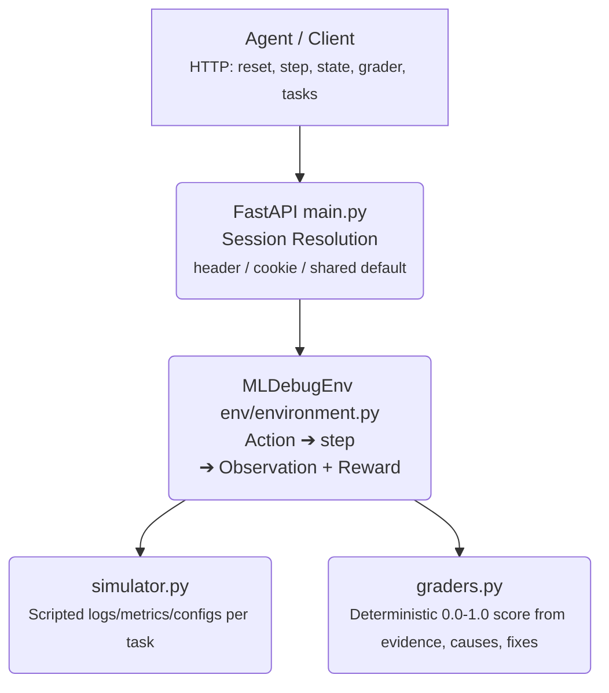

# ML Training Run Debugger

[](https://github.com/geethika-sandireddy/ml-agent-debug-benchmark/actions/workflows/ci.yml)
[](LICENSE)
[](https://geetss-ml-debug-env.hf.space)

OpenEnv-compatible RL environment for evaluating whether an LLM agent can debug ML systems: it reads logs, metrics, and configs, then proposes and applies fixes, on three deterministic tasks of increasing difficulty. Packaged as a stateless-or-stateful FastAPI server so any HTTP client — human, script, or agent — can drive it, and deployed live on Hugging Face Spaces.

**Live Space:** [geetss-ml-debug-env.hf.space](https://geetss-ml-debug-env.hf.space)

## Architecture




`inference.py` is a separate client that drives the same environment through an OpenAI-compatible LLM (or the scripted baseline in `env/baseline.py` as a fallback), emitting the `[START]/[STEP]/[END]` log contract required for scoring.

## Motivation

This benchmark targets a real engineering workflow: diagnosing failed or misleading ML training runs from incomplete evidence. The tasks reflect common debugging patterns that matter for agent evaluation:

- evidence gathering across logs, metrics, and configs
- causal reasoning from multiple weak signals
- distinguishing root causes from tempting distractors
- proposing and applying targeted fixes instead of guessing

The scenarios focus on recurring real issues: train/val preprocessing mismatch, redundant softmax before cross-entropy, and apparently healthy train/val metrics that hide leakage, imbalance, or a misleading primary metric.

## Why This Is A Useful Agent Benchmark

Many agent benchmarks test navigation or form-filling. This one tests something closer to senior ML debugging work:

- the agent must inspect multiple information sources before acting
- partial progress matters, not just final success
- wrong fixes and premature fixes are penalized
- the hard task requires uncovering multiple interacting causes

That makes the environment suitable for evaluating whether an agent can debug ML systems rather than just execute a fixed script.

## Tasks

### Task 1 - easy: train/val scaling mismatch

- Symptom: high train accuracy, flat validation.
- Likely cause: validation pipeline missing normalization that training has.
- Goal: find it in the configs, propose the matching fix, apply it.

### Task 2 - medium: double softmax

- Symptom: loss goes down while accuracy goes down.
- Likely cause: logits passed through softmax twice on the way to cross-entropy.
- Goal: trace the loss path and apply the fix.

### Task 3 - hard: silent generalization failure

- Symptom: strong train/val, weak test, no crashes.
- Causes: split leakage, class skew, wrong headline metric.
- Goal: surface each issue and apply all three fixes.

## Failure Mode Table

| Task | Observable Symptom | Hidden Cause(s) | Tempting Wrong Path |
|------|---------------------|-----------------|---------------------|
| Task 1 | Train accuracy is high, validation is flat | Validation transform missing normalization | Assume learning-rate or optimizer instability |
| Task 2 | Loss decreases while accuracy also decreases | Softmax is applied before `CrossEntropyLoss` | Tweak label smoothing or batch size instead |
| Task 3 | Train/val look strong, test collapses | Split leakage, class imbalance, wrong primary metric | Train longer, lower LR, or trust accuracy alone |

## What The Grader Rewards

The grader is deterministic and combines four ideas:

- evidence quality: did the agent reveal the task-critical clues?
- diagnosis quality: did it confirm the correct root causes?
- fix quality: did it apply the required fixes and avoid wrong ones?
- efficiency: did it finish without wasting the full step budget?

Blind guessing is intentionally weakened:

- wrong fixes are penalized
- premature fixes are penalized
- final completion requires the required fixes, required causes, and required evidence

## Actions

- `read_log(target)`
- `check_metric(target)`
- `inspect_config(target)`
- `propose_fix(target)`
- `apply_fix()`

## Observations

Fields include `task_id`, `description`, `difficulty`, `visible_logs`, `visible_metrics`, `visible_config`, `step_count`, `pending_fix`, `applied_fixes`, `message`, `done`.

## Reward Design

- revealing new useful information gives small positive reward
- unlocking task-critical evidence gives higher reward
- confirming a root cause gives a stronger reward bump
- proposing a correct fix after enough evidence gives partial credit
- applying the final required fix path finishes the episode
- repeated actions, wrong fixes, and premature fixes reduce overall score

## Local run

```bash
pip install -r requirements.txt
uvicorn main:app --host 0.0.0.0 --port 7860
```

## Testing & CI

```bash
pip install -r requirements.txt
pip install pytest pytest-cov ruff
ruff check .
pytest --cov=env --cov=server --cov=main --cov-report=term-missing
```

Every push and pull request to `main` runs lint (`ruff`) and the full test suite via GitHub Actions (see `.github/workflows/ci.yml`). Current coverage is ~83%, with `env/environment.py` — the core state machine — at 90%.

## Baseline (`inference.py`)

Uses the OpenAI-compatible client with env vars below. `HF_TOKEN` (or `OPENAI_API_KEY`) is required for inference runs.

```bash
export API_BASE_URL="https://router.huggingface.co/v1"
export MODEL_NAME="meta-llama/Llama-3.1-8B-Instruct"
export HF_TOKEN="your_token"
python inference.py
```

Required for the competition: `API_BASE_URL`, `MODEL_NAME`, `HF_TOKEN`.

Stdout format (per task): one `[START]`, one `[STEP]` per `step()`, one `[END]` after `close()`.

## Reference Baselines

The repo exposes two useful reference behaviors:

| Baseline | Purpose | Notes |
|----------|---------|-------|
| Scripted planner | Reproducible upper-reference trajectory | Used when fallback is enabled or through `/baseline` |
| Model-driven inference | Competition-facing baseline path | Uses the OpenAI-compatible client with `API_BASE_URL`, `MODEL_NAME`, and `HF_TOKEN` |

## Docker

```bash
docker build -t ml-debug-env .
docker run -p 7860:7860 \
  -e API_BASE_URL="https://router.huggingface.co/v1" \
  -e MODEL_NAME="meta-llama/Llama-3.1-8B-Instruct" \
  -e HF_TOKEN="your_token" \
  ml-debug-env
```

## HTTP API

| Method | Path | Purpose |
|--------|------|---------|
| GET | `/` | Health |
| POST | `/reset` | New episode |
| POST | `/step` | One action |
| GET | `/state` | Current state |
| GET | `/tasks` | Task list |
| GET | `/grader` | Score snapshot |
| GET | `/baseline` | Scripted baseline |

Session behavior:
- If `X-Session-Id` header or `openenv_session_id` cookie is present, that session is used (isolated clients).
- If neither is present, the API falls back to a shared `default` session for stateless evaluators.

## Notes

- Typed models: `Action`, `Observation`, `Reward` (see `env/environment.py`).
- `openenv.yaml` describes tasks and endpoints.
- Graders are deterministic; scores are in `[0.0, 1.0]`.
- `tests/test_api.py` and `tests/test_graders.py` cover endpoint behavior and grading invariants.

## Baseline scores (scripted policy)

Current reproducible run (`python inference.py`):
- `task_1`: `0.98`
- `task_2`: `0.98`
- `task_3`: `0.96`

## Limitations

- The environment is intentionally deterministic and compact rather than fully open-ended.
- The current benchmark focuses on three failure families, not the full space of ML debugging issues.
- Session state is held in-process (an LRU-capped in-memory dict); it does not survive a restart and would need an external store (e.g. Redis) to run behind multiple replicas.
- Future extensions could add optimizer bugs, label corruption, data loader failures, and distributed training diagnostics.

## Acknowledgements

Built for the **Meta × PyTorch OpenEnv Hackathon**, in partnership with **Scaler School of Technology**.

## License

[MIT](LICENSE)
